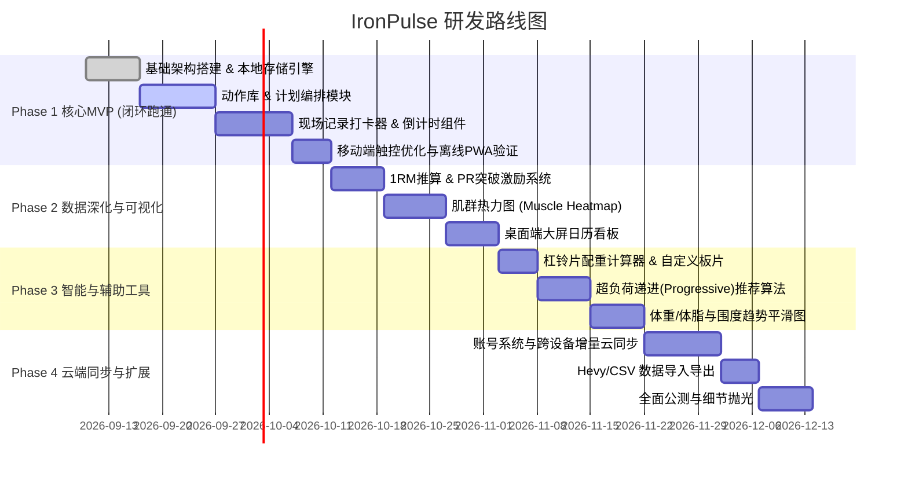

# 🏋️‍♂️ 健身多端管理平台 (IronPulse / 铁律) 产品调研与研发规划方案

---

## 一、 市场现状与竞品深度调研

目前市面上的健身数字化工具主要分化为三大阵营，各自有着明确的受众偏好与痛点壁垒：

### 1. 竞品全景拆解

| 竞品名称 | 阵营与核心定位 | 核心优势 | 致命痛点 / 体验断层 | 商业模式 |
| :--- | :--- | :--- | :--- | :--- |
| **Keep** | 综合型 / 泛大众跟练 | 课程库丰富、海量大众用户、硬件生态互联、社区活跃 | **极度臃肿**。开屏广告、直播带货、商城穿插；对中高阶力量训练极其不友好，组数/配重/RPE记录繁琐低效。 | 订阅会员 + 电商卖货 + 硬件销售 |
| **训记 (Xunji)** | 国内硬核力量打卡 (iOS/小程序) | 专为抗阻力量设计、UI极度干净无广告、动作库全、支持RPE/组间休息 | **多端割裂**。几乎没有好用的桌面Web端进行复杂周期编排；数据沉淀在封闭生态，缺乏高级智能分析。 | 买断制 / 会员订阅 |
| **Hevy** | 国际主流力量追踪 (App+简版Web) | 现代设计语言、极佳的打卡动效、社交Feed互动、WearOS/AppleWatch生态支持良好 | 订阅费用昂贵（国内支付门槛高）；Web端功能偏辅助且依赖强联网；中文化与本土化一般。 | 高客单价月/年订阅 (Freemium) |
| **Strong** | 国际经典老牌记录器 | 纯粹记录、历史稳定度高、1RM自动推算 | 多年迭代停滞、UI陈旧、免费版仅限3个自定义模板、无跨端本地优先支持。 | 昂贵订阅制 |
| **FitNotes** | 极客纯单机记录 (Android) | 极度轻量、完全离线、无广告、纯粹高效 | 界面停留在Android 4.0时代，无跨端同步能力，仅靠手动备份DB文件。 | 纯免费 / 捐赠 |

### 2. 核心用户痛点挖掘 (The Real Pain Points)

1. **地下室“铁馆”弱网断网**：
   大部分专业健身房或铁馆位于地下负一层，网络信号极差。传统依赖接口请求的 App/网页经常遇到“转圈等待”、“保存失败丢失训练组”的灾难体验。
2. **多端场景割裂**：
   - **计划编排（大屏）**：教练或严肃训练者习惯在电脑/平板大屏上查看月度/季度周期化训练计划（Periodization）、统计肌肉容量；
   - **现场执行（小屏/单手）**：在健身房训练时，双手充血出汗、气喘吁吁，需要**单手极速点按**、自动跳下一个动作、自动倒计时，绝对不能有复杂的表单输入。
3. **“渐进式超负荷”缺乏智能辅助**：
   增肌力量的核心法则是**超负荷渐进**（Progressive Overload）。很多软件只充当流水账本，不能根据上周状态自动计算“今天深蹲建议加重 2.5kg 还是加 1 次”，仍需脑内计算。
4. **身体围度、体重、体脂与力量负荷割裂**：
   训练记录在 App A，体重记录在体脂秤 App B，热量/饮食在 App C，无法在一个面板直观看到“容量增加与体重/体态变化的因果关联”。

---

## 二、 本项目定位与价值主张

> **产品定位**：  
> **面向严肃健身与体态管理者的“Local-First”极速多端工作台。**  
> 电脑端是强大的计划设计与长周期数据看板，手机端是轻快纯粹的掌上秒级打卡器。

- **Slogan**：掌控每一组负荷，雕刻每一寸肌肉。
- **设计哲学**：
  1. **零等待 (Instant Response)**：本地优先架构（Local-First），断网照样流畅记录，联网秒级同步。
  2. **极简高效 (Zero Friction)**：拒绝社区吹水、拒绝电商广告，把每一次点击缩减到极限。
  3. **数据主权 (Full Ownership)**：所有训练数据支持一键导出 CSV/JSON，拒绝被任何平台绑架。

---

## 三、 功能架构与必备功能清单 (MVP)

```mermaid
mindmap
  root((IronPulse 架构))
    训练执行引擎 (Training)
      动作库 (标准动作+自定义+肌肉着色)
      分化计划制定 (PPL/上下肢/周期化)
      现场极速记录 (组/重/次/RPE/热身组/递减组)
      杠铃片配重计算器 (Plate Calculator)
      智能组间休息计时器 (震动/声音提醒)
    数据看板与分析 (Analytics)
      肌群每周容量负荷 (Volume Load)
      1RM 极限推算曲线
      个人最佳记录 (PR) 自动捕捉
      人体肌肉疲劳/热力图 (Muscle Heatmap)
    体态与健康指标 (Body Metrics)
      体重移动平滑趋势线 (消除水分波动)
      身体围度测量记录 (臂围/胸围/腰围等)
      视觉对比相册 (Before/After 隐私图库)
    多端系统支撑 (Platform Core)
      PWA 渐进式离线支持 (Installable)
      响应式双模态交互 (桌面大屏 vs 移动单手)
      数据本地优先存储 + 云端增量同步
      标准格式数据导入/导出 (支持Hevy/训记兼容)
```

### 1. 必备基础功能 (MVP 阶段必须交付)

| 模块 | 功能名称 | 详细说明 |
| :--- | :--- | :--- |
| **动作库** | 科学动作系统 | 预置 200+ 常见抗阻、自重、有氧动作，标注主练肌群、辅助肌群、器械类型；支持用户自由添加自定义动作。 |
| **计划管理** | 训练日历与模板 | 支持创建周期计划（如推拉腿 PPL、上下肢分化、胸背/手臂分化），支持把过去的真实训练“一键存为模板”。 |
| **现场打卡** | 极速单手交互面板 | 默认自动填充上次训练重量与次数；一键勾选完成；支持标记 `热身组(W)`、`正常组`、`力竭组(F)`、`递减组(D)`、`超级组(SS)`。 |
| **辅助工具** | 智能组间倒计时 | 勾选完成组后自动唤醒倒计时（90s/120s/180s等），后台运行且到点震动/音效提醒，允许悬浮控制。 |
| **辅助工具** | 杠铃片计算器 | 输入目标重量（如 82.5kg）和空杆重（20kg/15kg），直观图形化显示左右两边各插什么颜色的片（20kg/15kg/10kg/5kg/2.5kg/1.25kg）。 |
| **数据洞察** | 1RM 与 PR 捕捉 | 基于 Epley / Brzycki 公式自动推算等效 1RM；单次突破自动弹出激励卡片（如“深蹲历史最高重量”、“硬拉最高容量”）。 |
| **多端适配** | 响应式 PWA 支持 | 支持在手机浏览器直接“添加到主屏幕”，无需繁琐的应用商店审核流程，拥有独立 App 启动窗口与离线缓存体验。 |

---

## 四、 核心亮点与差异化突破点 (Killer Features)

### 亮点 1：双模态交互架构 (Dual-Mode UX)
- **电脑/iPad 大屏模式**：提供类似 Linear / Notion 体验的高效工作台。以周历/甘特图视角拖拽排课，批量调整整周容量，适合周末静下心来复盘和做下个周期的训练设计。
- **手机小屏模式**：健身房专用态。大按键、大字体、单手手势操作（右滑完成一组，左滑删除，单击展开配重），在心率飙升到 150bpm 时依然零思考操作。

### 亮点 2：人体肌群周负荷“热力状态图” (Interactive Muscle Heatmap)
- 结合医学解剖学矢量人体图，根据用户过去 7 天记录的各个动作有效组数（Hard Sets）动态渲染肌肉色深（冷蓝 $\rightarrow$ 亮绿 $\rightarrow$ 橙黄 $\rightarrow$ 绯红）。
- **价值**：一眼看出哪个肌群还没练够推荐容量（例如背部本周才 8 组，推荐 14-18 组），哪个肌群处于过度训练/疲劳状态，让训练更科学。

### 亮点 3：离线优先与无感极速同步 (Local-First Architecture)
- 基于浏览器 IndexedDB 做底层存储，所有读写全部优先发生在本机，**延迟为 0ms**。
- 地下室无信号状态下随便记录，网络恢复后在后台通过增量差异（CRDT 或基于时间戳的同步算法）自动与云端合并，彻底告别丢数据。

### 亮点 4：超负荷递增推算助手 (Progressive Overload Advisor)
- 在进入下一次同一动作时，算法根据历史完成度给出精准指导：
  - *“上周 80kg 完成了 8-8-8，本周建议尝试 82.5kg × 6次 或 80kg × 9-9-8”*。
  - 省去翻找历史记录的比对精力，每一次走进健身房都目标清晰。

---

## 五、 研发技术选型建议

为了实现“多端一套代码”、“极致流畅”、“本地离线”，推荐以下技术路线：

- **前端架构**：**React / Next.js** 或 **Vite + React**（单页应用极速，易于做离线与 PWA）。
- **样式与设计系统**：现代硬朗暗黑风（Sleek Dark Mode），采用精密调优的 CSS Variables + 类似 Tailwind 的原子化样式，保证移动端触控目标不小于 44px。
- **本地离线存储**：**Dexie.js (IndexedDB 封装)** + LocalStorage 缓存，支持千万级历史组数快速查询。
- **后端与云同步**：轻量级 **Node.js / Hono** 或 **Supabase (PostgreSQL + Row-Level Security)**，提供开箱即用的 Auth 与实时数据同步机制。
- **PWA 方案**：Web App Manifest + Workbox Service Worker，实现原生级桌面/手机桌面快捷启动。

---

## 六、 研发计划与里程碑路线图 (Roadmap)

整个研发过程划分为四个阶段，预计周期 10-12 周：



### 里程碑交付标准：
- **Milestone 1 (第 4 周末)**：可用移动端 PWA，具备动作选择、计划创建、组数重量勾选、休息计时器，健身房实地打卡流畅可用。
- **Milestone 2 (第 7 周末)**：加入大屏周历看板与肌群热力图，形成完整的训练复盘数据分析体验。
- **Milestone 3 (第 9 周末)**：上线杠铃片计算器、超负荷建议与体重跟踪，打磨高质感暗黑 UI 与触感反馈。
- **Milestone 4 (第 12 周末)**：云端同步全面上线，支持多端数据实时互通与备份。
