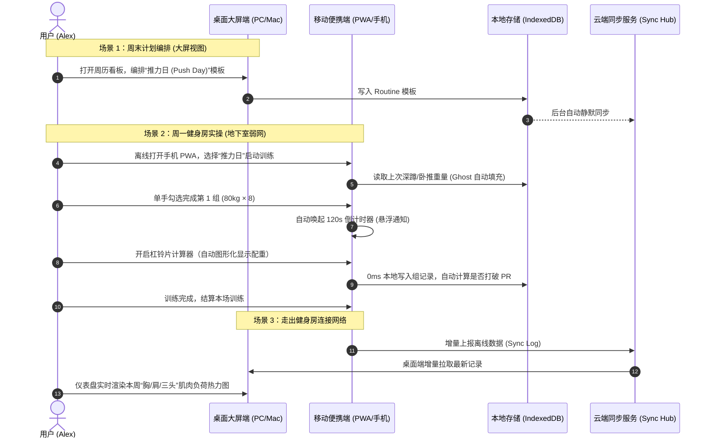

# 📋 IronPulse 健身多端管理平台 - 详细功能需求说明书 (FRS / PRD)

| 文档版本 | 发布日期 | 编制人 | 状态 | 目标受众 |
| :--- | :--- | :--- | :--- | :--- |
| **v1.0.0** | 2026-09-07 | Product Manager | 正式评审通过 | 产品团队、前端/全栈工程师、UI/UX 设计师 |

---

## 1. 引言与产品定位

### 1.1 项目背景与目标
**IronPulse (铁律)** 是专为严肃力量训练与体态管理爱好者打造的**本地优先 (Local-First) 多端健身工作台**。该产品旨在消除传统健身 App“功能臃肿”、“依赖网络无法在地下室使用”、“大屏小屏场景割裂”以及“数据闭门造车”的痛点，提供秒级单手打卡、大屏周期排课、肌肉负荷热力图、渐进式超负荷推导与 100% 本地离线可用的极致体验。

### 1.2 核心术语定义
- **1RM (One Repetition Maximum)**：单次最大重复重量，衡量最大肌力的基准。
- **RPE (Rate of Perceived Exertion)**：自觉用力程度评分（6-10 分制，例如 RPE 8 代表还能再做 2 次）。
- **有效组 (Hard Set)**：接近力竭的训练组（通常 RPE $\ge 7$），计入每周肌群增肌容量。
- **渐进式超负荷 (Progressive Overload)**：通过规律性增加负重、次数或容量，持续刺激肌肉与神经适应的核心增肌法则。
- **Local-First (本地优先)**：所有业务读写 100% 优先在本地浏览器（IndexedDB）完成，0ms 响应，云端仅作为异步多端同步通道。

---

## 2. 用户角色与典型使用场景

### 2.1 用户画像
- **角色 A (铁馆力量硬核者 - "Alex")**：
  - 每周训练 4-5 次，遵循 PPL 或上下肢分化；
  - 核心痛点：双手满是镁粉、心率高时，受够了复杂的表单；健身房地下室没网，App 动辄报错转圈；希望自动算好左右插几片杠铃片、倒计时结束震动。
- **角色 B (科学健身进阶者 - "Elena")**：
  - 关注肌肉恢复、每周肌群有效组数、1RM 增长曲线与体脂体重波动；
  - 核心痛点：习惯在 PC/Mac 上用大屏幕复盘整周容量与制定下周训练计划，但现有的力量 App 几乎全都是纯手机端，网页端残缺或需要昂贵付费。

### 2.2 核心跨端场景流

---

## 3. 功能模块详细规格说明

### 3.1 模块一：科学动作库 (Exercise Directory)

#### 3.1.1 功能概述
提供全面的力量、自重及有氧动作知识库，支持多维度过滤、动作教学指引及用户高度自定义扩展。

#### 3.1.2 详细功能点
1. **分类检索系统**：
   - **主肌群 (Target Muscles)**：胸部 (Chest)、背部 (Back)、肩部 (Shoulders)、肱二头肌 (Biceps)、肱三头肌 (Triceps)、股四头肌 (Quads)、腘绳肌/臀部 (Glutes/Hamstrings)、核心 (Core)、小腿 (Calves)。
   - **器械类型 (Equipment)**：杠铃 (Barbell)、哑铃 (Dumbbell)、龙门架绳索 (Cable)、固定器械 (Machine)、自重 (Bodyweight)、史密斯机 (Smith Machine)、有氧器械。
2. **预置动作与自定义动作 (CRUD)**：
   - 预置 200+ 国际标准力量训练动作（附带动作规范说明、目标肌群与协同肌群）；
   - 支持新增自定义动作：支持名称、英文别名、主肌群、次要肌群、器械类型、默认休息时长、动作注意事项备注；
   - 自定义动作支持编辑、归档隐藏，系统预置动作不可删除但支持个性化备注与收藏。
3. **动作历史表现聚合 (Exercise Deep Dive)**：
   - 单击动作进入详情页，自动汇总该动作的所有历史日志；
   - 展示历史 1RM 趋势曲线、历史单次最大负荷 (Max Weight)、历史最高单组容量 (Weight × Reps)。

---

### 3.2 模块二：周期计划与模板编排 (Routine & Program Builder)

#### 3.2.1 功能概述
支持用户构建长周期的分化训练体系，灵活添加、调序及预设目标负荷。

#### 3.2.2 详细功能点
1. **分化模板创建**：
   - 支持创建自定义计划文件夹（如“春季增肌 PPL 循环”、“5×5 力量举举重计划”）；
   - 支持多训练日配置（Day 1: 胸+肩前束；Day 2: 背+二头；Day 3: 腿部核心）；
2. **模板动作结构配置**：
   - 在模板中添加动作，支持**拖拽调序 (Drag & Drop)**；
   - 预设每个动作的目标组数、目标次数区间（如 8-10 次）、推荐 RPE 及默认休息秒数；
   - 支持配置**超级组 (Supersets)**：将两个或多个动作组合联动，打卡时交替切换。
3. **智能生成与转存**：
   - **实际记录一键转存为模板**：在完成任意一次自由打卡后，支持点击“保存为新模板”；
   - **模板导出与分享**：支持生成纯文本或 JSON 格式，方便与搭子（训练伙伴）共享。

---

### 3.3 模块三：现场打卡记录引擎 (Active Workout Session)

#### 3.3.1 功能概述
这是**最高频、对交互敏捷度要求最严苛**的核心引擎。必须在单手持机、出汗、手抖状态下依然零差错。

#### 3.3.2 界面布局与交互规则
- **顶部常驻栏**：训练总时长计时器、完成动作进度（如 3/6）、总训练容量累积（kg）、右上角“完成训练 / 取消”按钮；
- **动作卡片区**：
  - 卡片头部：动作名称、替换动作按钮、历史最佳展示、添加单组按钮；
  - 表格列配置：`[组号]`、`[上次记录 (Ghost 灰字)]`、`[重量 (kg)]`、`[次数 (reps)]`、`[RPE (选填)]`、`[一键打勾 ✓]`。

#### 3.3.3 详细功能规则
1. **Ghost 预填充机制**：
   - 启动训练后，自动拉取该用户上次执行该动作时的对应组重量和次数，以灰色虚影展示；
   - 若用户本次直接点击“✓”，自动继承上次的重量和次数；若需调整，支持点击快速微调。
2. **快捷键盘与增量微调**：
   - 点击重量/次数输入框，呼出定制快速步进键盘：
     - 重量快捷键：`+1.25`、`+2.5`、`+5`、`-2.5`、`归零`；
     - 次数快捷键：`+1`、`+2`、`-1`；
3. **组类型标记 (Set Type Tagging)**：
   - 单击组号可快速切换类型：
     - **Normal**：常规工作组（默认）；
     - **Warmup (W)**：热身组（计入总组数，但不计入核心增肌有效容量）；
     - **Drop Set (D)**：递减组（上一组力竭后立即降重再做）；
     - **Failure (F)**：力竭组（标记做到力竭，RPE 10）；
4. **手势与快速动作**：
   - **向右轻滑**：标记完成当前组，并**自动激活组间休息倒计时**；
   - **向左轻滑**：删除该组或清空输入；
5. **PR 触发与视觉反馈**：
   - 当完成组的计算重量或推算 1RM 突破历史记录时，该行立即出现金色徽章动画 `🏆 New PR!`。

---

### 3.4 模块四：训练辅助工具集 (Utilities)

#### 3.4.1 智能组间倒计时器 (Smart Rest Timer)
1. **触发机制**：
   - 任意训练组点击“✓”时自动启动（可设置开启/关闭，或针对热身组不启动）；
   - 依据动作类型自动匹配默认时长（例如：大重量深蹲/硬拉默认 180s，手臂侧平举默认 60s）；
2. **多模态提醒**：
   - 悬浮在屏幕底部，倒计时数字大号显示，支持快速 `+30s` / `-30s` / `跳过`；
   - 倒计时最后 3 秒执行短促提示音，到点后调用浏览器 `navigator.vibrate([200, 100, 200])` 强力震动提醒；
   - 支持最小化为浮动泡泡，在切换查看其他动作或历史记录时不中断。

#### 3.4.2 杠铃片配重可视化计算器 (Plate Calculator)
1. **业务输入**：
   - 目标总重量（如 102.5kg）；
   - 杠铃空杆重选择：20kg (标准奥杆) / 15kg (女子/轻量杆) / 10kg / 0kg；
2. **配重贪心分配算法**：
   - 单边所需重量 = $(目标总重 - 杆重) / 2$；
   - 预设可选杠片库：`[25kg, 20kg, 15kg, 10kg, 5kg, 2.5kg, 1.25kg, 0.5kg]`；
   - 算法计算最少片数组合，若无法精确组合，提示差额并给出最接近搭配；
3. **可视化渲染**：
   - 模拟杠铃套筒，以国际标准杠片颜色（25kg红、20kg蓝、15kg黄、10kg绿、5kg白/黑等）渲染横向插片示意图，一目了然。

---

### 3.5 模块五：数据洞察与渐进式超负荷引擎 (Analytics & Overload Engine)

#### 3.5.1 1RM 科学估算模型
系统支持经典 Epley 公式与 Brzycki 公式切换：
$$\text{Epley 估算公式}: 1RM = W \times \left(1 + \frac{R}{30}\right) \quad (\text{当 } R > 1)$$
$$\text{Brzycki 估算公式}: 1RM = W \times \frac{36}{37 - R}$$
*(注：当实际完成次数 $R \ge 15$ 时，神经耐力因素占比过大，系统自动降低 1RM 换算权重并给予提示)*。

#### 3.5.2 人体肌群周负荷热力图 (Muscle Heatmap)
1. **计算模型**：
   - 统计过去 7 天内各肌群所承担的**有效组数 (Hard Sets)**；
   - 协同肌群折半计算（例如：卧推对胸大肌计 1 组，对肱三头肌和肩前束各计 0.5 组）；
2. **色彩渲染规则**：
   - 0-4 组（刺激不足/已完全恢复）：淡灰蓝；
   - 5-9 组（维持容量）：明亮蓝绿；
   - 10-18 组（最佳增肌超量恢复区间）：荧光鲜绿至金黄；
   - 20 组以上（过度训练/高疲劳）：亮橙红至绯红；
3. **交互**：
   - 点击热力图上的特定肌肉（如背阔肌），右侧弹出该肌群本周的训练分布和建议组数缺口。

#### 3.5.3 渐进超负荷智能提示 (Progressive Overload Advisor)
在进入动作打卡时，算法基于上次该动作的数据，自动输出一条指导建议：
- 若上次各组全部达到目标上限（如 80kg × 10, 10, 10，目标为 8-10 次）：
  - 建议：`“上次已达容量上限！今日建议进阶：尝试 82.5kg × 8次（负荷突破）”`；
- 若上次次数未封顶（如 80kg × 9, 8, 7）：
  - 建议：`“今日建议次数累积：保持 80kg，目标第1组突破至 10 次”`。

---

### 3.6 模块六：体态、体重与恢复追踪 (Body & Health)

1. **体重与 7 日移动平滑线**：
   - 支持每日快速输入晨起空腹体重与体脂率；
   - 自动计算 7 天滑动平均值 (7-Day Moving Average)，剔除盐分、碳水储水及肠道残留带来的虚假体重暴涨暴跌。
2. **围度追踪**：
   - 支持记录颈围、肩宽、胸围、左右上臂围、腰围（肚脐水平）、臀围、左右大腿围、小腿围；
   - 自动生成围度增长与减小趋势折线。
3. **隐私对比画廊 (Before / After)**：
   - 拍照记录体态（正面、侧面、背面）；
   - 数据完全保留在本地客户端（IndexedDB Blob），支持左右滑动双图比对（Diff Slider）。

---

### 3.7 模块七：跨端支持与数据备份 (Portability & PWA)

1. **PWA (渐进式 Web 应用)**：
   - 支持 Web App Manifest，支持手机“添加到主屏幕”，全屏沉浸运行，无浏览器顶栏底栏干扰；
   - Service Worker 预缓存核心静态资产，离线秒开。
2. **数据完全所有权 (Data Sovereignty)**：
   - **一键导出**：支持导出为结构化 `ironpulse_backup.json` 及清洗过的 `workouts.csv`；
   - **一键导入**：支持恢复 JSON 备份文件；
   - **竞品兼容**：支持解析导入 Hevy / 训记 导出的 CSV/JSON 训练历史，实现无痛搬家。

---

## 4. 非功能性需求 (NFR)

### 4.1 性能与体验指标
- **冷启动加载**：在 4G/弱网环境下首屏有意义绘制 (FCP) $\le 1.2\text{s}$；
- **打卡交互延迟**：单手勾选、输入切换、组间倒计时激活的响应感知时间 $\le 16\text{ms}$（确保 60FPS 流畅动效）；
- **离线可靠性**：无网状态下，用户可以执行 100% 的动作浏览、模板创建、现场记录和历史查看功能。

### 4.2 容灾与会话保护 (Crash Resistance)
- **草稿自动恢复**：若训练中途手机没电关机、切到后台被系统杀死或意外刷新浏览器，重新打开站点时必须无弹窗秒级恢复当前正在进行的训练（包含已用时间、所有已勾选的组数据）。

### 4.3 视觉与可用性规范
- **设计基调**：现代硬核暗黑风（Pure Dark `#0a0a0c` 背景搭配 Neon/Amber 强调色），保护健身房昏暗环境下的视力并降低 OLED 屏幕功耗；
- **触控靶区**：移动端打卡界面的所有关键按钮（勾选框、步进按钮）最小触控区域必须 $\ge 48\text{px} \times 48\text{px}$，防误触间距 $\ge 8\text{px}$。
