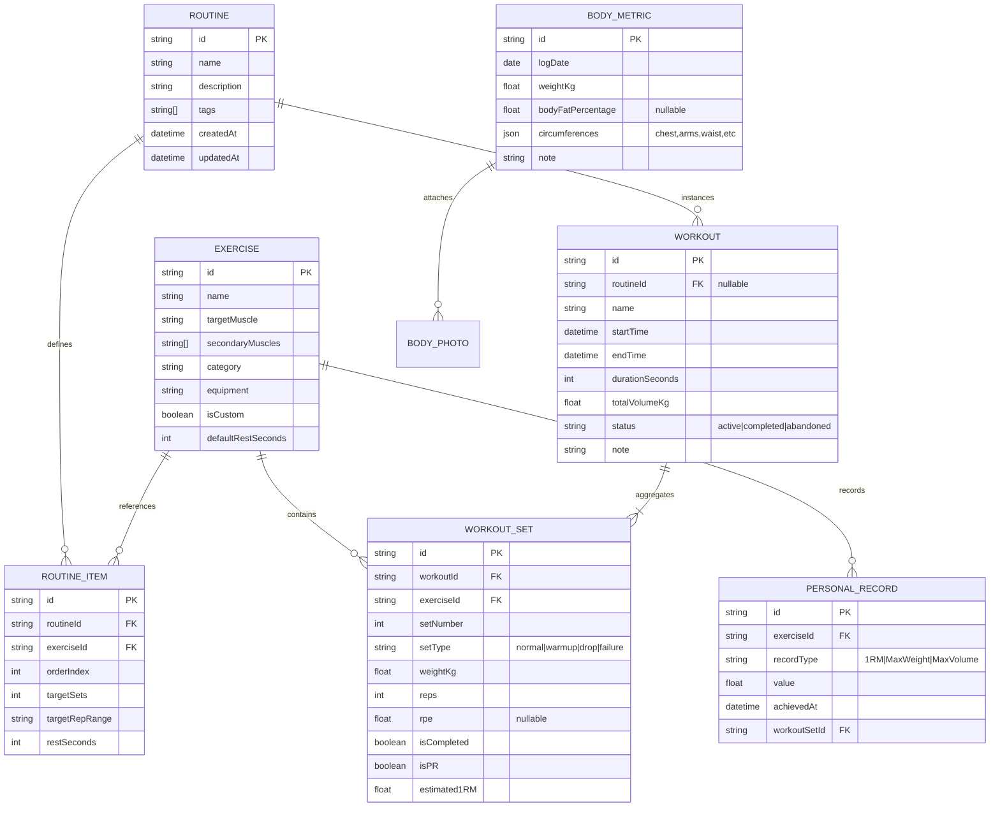
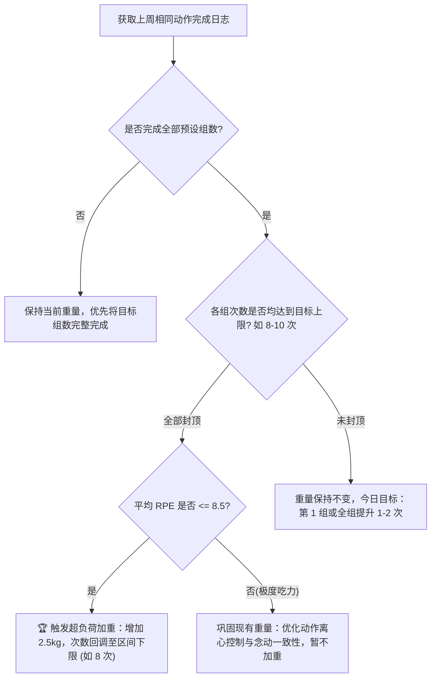

# 🏗️ IronPulse 健身多端管理平台 - 详细软件设计文档 (SDD)

| 文档版本 | 更新日期 | 架构师 / 工程师 | 状态 | 目标受众 |
| :--- | :--- | :--- | :--- | :--- |
| **v1.0.0** | 2026-09-07 | System Architect | 审定执行 | 前端研发团队、全栈工程师、QA 自动化测试 |

---

## 1. 系统总体架构与技术选型

### 1.1 架构设计理念 (Local-First Architecture)
IronPulse 采用 **Local-First (本地优先)** 架构原则：
1. **客户端作为唯一真实权威 (Single Source of Truth locally)**：所有的读写事务全部优先落盘到客户端浏览器高性能数据库（IndexedDB），写入延迟为 0ms，完全消除弱网/无网卡顿；
2. **异步增量同步 (Asynchronous Delta Sync)**：网络可用时，后台同步工作器（Sync Worker）以变更队列（Mutation Queue）的形式将本地增量上报至云端，并拉取多端差异进行基于时间戳的冲突归并；
3. **PWA 离线容器**：通过 Service Worker 拦截静态资源与应用外壳（App Shell），实现近乎原生 App 的桌面与移动端启动和运行表现。

```mermaid
graph TB
    subgraph Client [客户端浏览器 / PWA 容器]
        UI[React UI 视图层 (TailwindCSS + Lucide)]
        Zustand[Zustand 响应式全局状态树]
        ActiveDraft[训练会话崩溃自愈暂存器 (Session Draft)]
        
        subgraph LocalEngine [本地离线核心引擎]
            OverloadEngine[超负荷推荐算法]
            PlateEngine[杠铃片分配引擎]
            AudioHaptic[WebAudio 哔哔音效 / 震动控制器]
        end

        Dexie[(Dexie.js - IndexedDB 本地数据库)]
        SyncQueue[(离线变更队列 Sync Queue)]
        SW[Service Worker / Workbox 离线缓存]
    end

    subgraph Network [网络与同步通道]
        HTTP[REST / WebSocket 异步增量通信]
    end

    subgraph Cloud [云端协同服务]
        AuthService[用户鉴权 (JWT / OAuth)]
        SyncHub[多端状态聚合与冲突合并器]
        CloudDB[(PostgreSQL / Supabase 云数据库)]
    end

    UI --> Zustand
    Zustand <--> LocalEngine
    Zustand --> ActiveDraft
    Zustand <--> Dexie
    Dexie --> SyncQueue
    SyncQueue -.->|网络连通时后台触发| HTTP
    HTTP <--> SyncHub
    SyncHub <--> CloudDB
    SW -.->|拦截加载静态资源| UI
```

### 1.2 关键技术栈选型矩阵

| 技术维度 | 选型方案 | 选型理由与技术收益 |
| :--- | :--- | :--- |
| **前端基座** | **Vite + React 18/19 (TypeScript)** | 极速冷启动构建，成熟严谨的静态类型系统，保证训练核心数学公式与数据模型的类型安全。 |
| **样式与设计系统** | **TailwindCSS + CSS Variables** | 原子化灵活布局，纯纯定制极致质感的硬核暗黑调色板（Pure Dark `#0a0a0c`），开箱即用的多端响应式断点（`sm`, `md`, `lg`）。 |
| **本地持久化** | **Dexie.js (IndexedDB)** | 包装了复杂的 IndexedDB API，提供毫秒级复杂索引查询、ACID 事务支持以及对离线千万级打卡记录的高性能存储。 |
| **状态管理** | **Zustand** | 极其轻量（<1KB），比 Redux 干净、比 Context API 性能高（支持细粒度 selector 避免打卡界面的多余重绘），原生支持中间件。 |
| **离线与 PWA** | **vite-plugin-pwa (Workbox)** | 自动生成 Manifest 和 CacheFirst 策略的 Service Worker，轻松实现“添加到手机主屏幕”。 |
| **数据可视化** | **Recharts + 交互式 SVG 人体图** | 矢量级人体肌肉解剖图支持根据组数动态变更 CSS 填充色；Recharts 提供 1RM、容量与体重的平滑曲线绘制。 |
| **触感与提示音** | **Web Audio API + Navigator Vibration** | 无需外置 MP3 资源，直接合成 880Hz 短促高频哔哔声；组间休息完成触发强力双脉冲震动。 |

---

## 2. 数据模型与存储架构设计 (Data Schema)

### 2.1 实体关系模型 (ER Diagram)



### 2.2 核心 TypeScript 接口定义与 Dexie 表结构

```typescript
// ==================== 1. 动作库模型 ====================
export type MuscleGroup = 
  | 'chest' | 'back' | 'shoulders' | 'biceps' 
  | 'triceps' | 'quads' | 'hamstrings' | 'glutes' 
  | 'calves' | 'core' | 'fullBody';

export type EquipmentType = 
  | 'barbell' | 'dumbbell' | 'cable' | 'machine' 
  | 'bodyweight' | 'smith' | 'other';

export interface Exercise {
  id: string;                      // 唯一 UUID
  name: string;                    // 动作中文名 (如: 杠铃平板卧推)
  nameEn?: string;                 // 英文名 (Barbell Bench Press)
  targetMuscle: MuscleGroup;       // 主要目标肌群
  secondaryMuscles: MuscleGroup[]; // 协同协同肌群
  equipment: EquipmentType;        // 所需器械
  defaultRestSeconds: number;      // 默认组间休息 (秒)
  isCustom: boolean;               // 是否为用户自定义
  notes?: string;                  // 动作要点/个人注意事项
  createdAt: number;
  updatedAt: number;
}

// ==================== 2. 现场训练组模型 ====================
export type SetType = 'normal' | 'warmup' | 'drop' | 'failure';

export interface WorkoutSet {
  id: string;                      // UUID
  workoutId: string;               // 关联训练记录 ID
  exerciseId: string;              // 关联动作 ID
  setNumber: number;               // 组号 (1, 2, 3...)
  setType: SetType;                // 组类型
  weightKg: number;                // 负荷重量
  reps: number;                    // 完成次数
  rpe?: number;                    // 自觉竭尽度 (6.0 - 10.0)
  isCompleted: boolean;            // 是否已勾选完成
  isPR: boolean;                   // 是否创下该动作新历史纪录
  estimated1RM: number;            // 基于公式计算的当组等效 1RM
  completedAt?: number;            // 打卡完成时刻 Unix 时间戳
}

// ==================== 3. 训练会话主表 ====================
export type WorkoutStatus = 'active' | 'completed' | 'abandoned';

export interface Workout {
  id: string;
  routineId?: string;              // 来源模板 ID (若自由训练则为空)
  name: string;                    // 本次训练名称 (如: 周一胸肩轰炸)
  startTime: number;               // 开始时间戳
  endTime?: number;                // 结束时间戳
  durationSeconds: number;         // 耗时 (秒)
  totalVolumeKg: number;           // 净有效训练容量 = sum(weight * reps) [排除热身组]
  setsCount: number;               // 完成总组数
  status: WorkoutStatus;           // 会话状态
  note?: string;                   // 训练复盘心得
}

// ==================== 4. 离线同步队列 ====================
export interface SyncMutation {
  id: string;
  entity: 'exercises' | 'routines' | 'workouts' | 'workout_sets' | 'body_metrics';
  action: 'CREATE' | 'UPDATE' | 'DELETE';
  recordId: string;
  payload: any;
  clientTimestamp: number;
  syncStatus: 'pending' | 'synced' | 'failed';
}
```

### 2.3 Dexie 数据库定义 (db.ts)
```typescript
import Dexie, { Table } from 'dexie';

export class IronPulseDB extends Dexie {
  exercises!: Table<Exercise, string>;
  workouts!: Table<Workout, string>;
  workoutSets!: Table<WorkoutSet, string>;
  routines!: Table<any, string>;
  bodyMetrics!: Table<any, string>;
  personalRecords!: Table<any, string>;
  syncQueue!: Table<SyncMutation, string>;

  constructor() {
    super('IronPulseDB');
    this.version(1).stores({
      exercises: 'id, targetMuscle, equipment, isCustom, name',
      workouts: 'id, routineId, startTime, status',
      workoutSets: 'id, workoutId, exerciseId, [workoutId+exerciseId], isCompleted',
      routines: 'id, name, updatedAt',
      bodyMetrics: 'id, logDate',
      personalRecords: 'id, exerciseId, recordType, value',
      syncQueue: 'id, entity, syncStatus, clientTimestamp'
    });
  }
}

export const db = new IronPulseDB();
```

---

## 3. 核心算法与业务计算引擎实现

### 3.1 1RM 与等效容量推算引擎 (OneRepMax.ts)
```typescript
/**
 * 基于经典 Epley 公式计算等效单次极限重量 (1RM)
 * 公式: 1RM = Weight * (1 + Reps / 30)
 */
export function calculateEpley1RM(weightKg: number, reps: number): number {
  if (reps <= 0 || weightKg <= 0) return 0;
  if (reps === 1) return weightKg;
  // 超过 15 次时递减修正，防止高次数耐力组虚高
  const effectiveReps = reps > 15 ? 15 + (reps - 15) * 0.5 : reps;
  const result = weightKg * (1 + effectiveReps / 30);
  return Math.round(result * 10) / 10;
}

/**
 * 实时判断当前完成组是否打破个人历史纪录 (PR)
 */
export function evaluatePR(
  currentSet: { weightKg: number; reps: number },
  historySets: { weightKg: number; reps: number }[]
): { isWeightPR: boolean; is1RMPR: boolean; isVolumePR: boolean } {
  if (!historySets || historySets.length === 0) {
    return { isWeightPR: true, is1RMPR: true, isVolumePR: true };
  }

  const current1RM = calculateEpley1RM(currentSet.weightKg, currentSet.reps);
  const currentVolume = currentSet.weightKg * currentSet.reps;

  const maxHistoryWeight = Math.max(...historySets.map(s => s.weightKg));
  const maxHistory1RM = Math.max(...historySets.map(s => calculateEpley1RM(s.weightKg, s.reps)));
  const maxHistoryVolume = Math.max(...historySets.map(s => s.weightKg * s.reps));

  return {
    isWeightPR: currentSet.weightKg > maxHistoryWeight,
    is1RMPR: current1RM > maxHistory1RM,
    isVolumePR: currentVolume > maxHistoryVolume
  };
}
```

### 3.2 杠铃片最优贪心分配算法 (PlateCalculator.ts)
```typescript
export interface PlateConfig {
  barbellWeightKg: number; // 杆重: 20 | 15 | 10
  availablePlates: number[]; // 单边可用片规格: [25, 20, 15, 10, 5, 2.5, 1.25]
}

export interface PlateResult {
  targetWeight: number;
  actualWeight: number;
  sideWeight: number;
  platesPerSide: { weight: number; count: number; color: string }[];
  isExact: boolean;
}

const PLATE_COLORS: Record<number, string> = {
  25: '#DC2626', // 红色
  20: '#2563EB', // 蓝色
  15: '#EAB308', // 黄色
  10: '#16A34A', // 绿色
  5: '#FFFFFF',  // 白色
  2.5: '#1F2937',// 黑色
  1.25: '#9CA3AF'// 灰色
};

export function calculatePlates(targetWeight: number, config: PlateConfig): PlateResult {
  const { barbellWeightKg, availablePlates } = config;
  
  if (targetWeight <= barbellWeightKg) {
    return {
      targetWeight,
      actualWeight: barbellWeightKg,
      sideWeight: 0,
      platesPerSide: [],
      isExact: targetWeight === barbellWeightKg
    };
  }

  const neededTotal = targetWeight - barbellWeightKg;
  let remainingPerSide = neededTotal / 2;
  const sortedPlates = [...availablePlates].sort((a, b) => b - a);
  const resultPlates: { weight: number; count: number; color: string }[] = [];

  for (const plate of sortedPlates) {
    if (remainingPerSide >= plate) {
      const count = Math.floor(remainingPerSide / plate);
      resultPlates.push({
        weight: plate,
        count,
        color: PLATE_COLORS[plate] || '#4B5563'
      });
      remainingPerSide -= count * plate;
      remainingPerSide = Math.round(remainingPerSide * 100) / 100; // 解决浮点精度
    }
  }

  const actualSide = resultPlates.reduce((acc, cur) => acc + cur.weight * cur.count, 0);
  const actualWeight = barbellWeightKg + actualSide * 2;

  return {
    targetWeight,
    actualWeight,
    sideWeight: actualSide,
    platesPerSide: resultPlates,
    isExact: actualWeight === targetWeight
  };
}
```

### 3.3 渐进式超负荷决策状态机 (OverloadAdvisor.ts)


---

## 4. Local-First 离线持久化与会话崩溃自愈设计

### 4.1 训练中途崩溃自愈 (Active Workout Crash Recovery)
为了确保用户在极端场景（手机突然没电关机、切换杀后台、意外刷新网页）下**数据绝对不丢失**：
1. **持久化暂存键**：在进行训练打卡时，Zustand 的 `activeWorkoutStore` 通过 `zustand/middleware/persist` 同步写入 `localStorage.getItem('ironpulse_active_draft')`；
2. **初始化恢复流水线 (App Bootstrapping)**：
```typescript
// App 初始化时执行
export function restoreActiveWorkoutSession() {
  const draft = localStorage.getItem('ironpulse_active_draft');
  if (draft) {
    try {
      const session = JSON.parse(draft);
      if (session && session.status === 'active') {
        console.warn('检测到未完成的训练会话，正在自动无损恢复...');
        useWorkoutStore.getState().resumeSession(session);
      }
    } catch (e) {
      console.error('会话恢复失败', e);
    }
  }
}
```

### 4.2 离线变更队列与增量云同步逻辑
当网络联通时，客户端将自动执行后台批处理：
1. 客户端在执行每一次 `CREATE/UPDATE/DELETE` 时，除了更新 Dexie 实体表，额外向 `syncQueue` 表写入一条带有唯一 UUID 和客户端精确毫秒时间戳的 Mutation 记录；
2. SyncWorker 定时检测 `navigator.onLine` 状态；
3. 将 `status === 'pending'` 的记录按时间戳升序通过 HTTP POST 批量推送至 `/api/sync/delta`；
4. 服务端采用 **LWW (Last-Write-Wins 基于时间戳最终一致性)** 解决实体冲突，并回传服务端最新游标 (Cursor)；
5. 客户端收到确认回执后，清空已同步的队列条目。

---

## 5. UI 组件层级结构与多端响应式路由

### 5.1 路由架构 (React Router v6)
```
/ (RootLayout)
 ├── /dashboard                 # 仪表盘：本周肌群热力图、周有效容量、体重概览
 ├── /workouts                  # 训练日志历史列表 (虚拟长列表)
 ├── /workouts/active           # [核心] 现场极速打卡界面 (沉浸态，隐藏底部导航)
 ├── /routines                  # 周期计划库与分化模板管理 (PPL/上下肢)
 ├── /routines/builder          # 模板可视化编排器 (支持拖拽排序)
 ├── /exercises                 # 200+ 动作百科库、动作详情与历史表现
 ├── /analytics                 # 深度数据分析 (1RM 曲线、肌群组数雷达图)
 ├── /body                      # 体重 7 日平滑趋势、身体围度、前后体态比对相册
 └── /settings                  # 杠铃片规格设置、数据一键 JSON/CSV 导出与导入
```

### 5.2 核心组件层级拓扑

```mermaid
graph TD
    App[App.tsx 全局根组件] --> PWAProvider[PWA 离线与更新提示]
    App --> RootLayout[RootLayout 响应式布局容器]
    
    RootLayout --> Sidebar[桌面端侧边导航栏 (Desktop Only)]
    RootLayout --> BottomNav[移动端触控底栏 (Mobile Only)]
    RootLayout --> PageContent[页面主路由插槽]
    RootLayout --> GlobalRestTimer[全局挂载：组间休息倒计时悬浮窗]

    PageContent --> ActiveWorkoutPage[ActiveWorkout 打卡引擎]
    
    ActiveWorkoutPage --> Header[顶部：耗时秒表 / 总容量 / 完成结算]
    ActiveWorkoutPage --> ExerciseList[动作卡片列表]
    
    ExerciseList --> ExerciseCard[单个动作容器]
    ExerciseCard --> SetRow[单组行 (组号/上次Ghost/重量/次数/打勾)]
    ExerciseCard --> AddSetBtn[快速增加组按钮]
    
    SetRow --> QuickStepPad[重量次数步进弹层]
    SetRow --> PlateCalcModal[杠铃片配重展开视窗]
```

### 5.3 移动端单手交互与触控优化规范
1. **触控区域 (Touch Targets)**：
   - 勾选完成按钮（✓）设定为 $52\text{px} \times 52\text{px}$，配高亮绿色边框；
   - 重量/次数步进按钮设定为大号药丸形态，支持长按连续步进。
2. **手势操作**：
   - 使用 Framer Motion 实现行级滑动操作：
     - 向右滑动 $\ge 80\text{px}$：触发完成打卡并触发触感反馈；
     - 向左滑动 $\ge 80\text{px}$：呼出删除该组确认按钮。
3. **沉浸式训练态 (Workout Zen Mode)**：
   - 一旦进入 `/workouts/active`，自动隐藏常规底部导航栏与杂项按钮，最大化可视空间给动作卡片；
   - 唤醒 Wake Lock API 防止手机在训练中途自动锁屏。

---

## 6. 音效与触感反馈实现 (Web Audio & Haptics)

为了避免在离线状态下载外置音频文件造成的网络依赖，音效采用原生 Web Audio API 进行振荡器物理合成：

```typescript
class FeedbackEngine {
  private ctx: AudioContext | null = null;

  private initCtx() {
    if (!this.ctx) {
      this.ctx = new (window.AudioContext || (window as any).webkitAudioContext)();
    }
  }

  /**
   * 组间休息结束：双短促提示音 (880Hz A5 音)
   */
  public playTimerComplete() {
    this.initCtx();
    if (!this.ctx) return;

    const now = this.ctx.currentTime;
    const osc = this.ctx.createOscillator();
    const gain = this.ctx.createGain();

    osc.type = 'sine';
    osc.frequency.setValueAtTime(880, now); // 880Hz
    gain.gain.setValueAtTime(0.3, now);
    gain.gain.exponentialRampToValueAtTime(0.001, now + 0.3);

    osc.connect(gain);
    gain.connect(this.ctx.destination);

    osc.start(now);
    osc.stop(now + 0.3);

    // 联动硬件震动
    if (typeof navigator !== 'undefined' && navigator.vibrate) {
      navigator.vibrate([200, 100, 200, 100, 400]);
    }
  }
}

export const feedback = new FeedbackEngine();
```

---

## 7. 质量保证、测试与上线准备 (QA Strategy)

### 7.1 单元测试关注点 (Unit Tests)
- **1RM 计算器边界**：测试 $reps=1, reps=15, reps=30$ 等极端边界，确保绝不返回 `NaN` 或负数；
- **杠铃片分配贪心算法**：测试各种奇数配重（如 $31.25\text{kg}$）、小于杆重（$15\text{kg}$）时的防御性兜底；
- **超负荷推算状态转移**：确保状态转移覆盖“全部封顶”、“部分完成”、“极度力竭”等分支。

### 7.2 离线验收测试步骤 (Offline E2E Verification)
1. 在 Chrome DevTools 中切换至 `Network: Offline`；
2. 启动“新建推力日”训练，勾选 4 组卧推并打卡；
3. 验证本地总训练容量（Volume）实时计算准确；
4. 强制刷新页面（`Ctrl + R`），验证训练进度完全保持；
5. 结束训练，检查 IndexedDB 成功持久化一条完整记录；
6. 恢复网络，验证后台变更队列被平稳消费。
