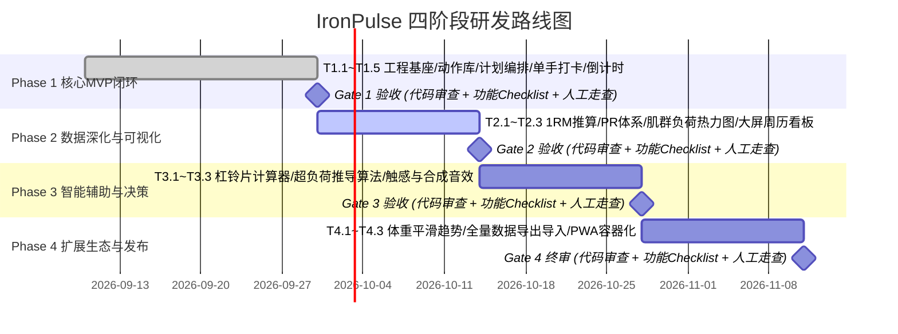

# 📊 IronPulse 健身多端管理平台 - 研发追踪与验收管理文档 (R&D Tracker)

| 文档版本 | 更新日期 | 负责团队 | 验收执行方式 |
| :--- | :--- | :--- | :--- |
| **v1.1.0** | 2026-09-07 | PM / 全栈研发 / QA 团队 | **代码审查 + 功能 Checklist + 人工验收（无线上调试依赖）** |

---

## 1. 验收管理准则 (Definition of Done)

为保证项目工程质量与真实场景可用性，本项目的每一个阶段验收均由 **三道防护网** 构成：
1. **代码审查标准 (Code Review)**：TypeScript 类型严格、无死循环/内存泄漏风险、构建产物 0 警告、架构符合 Local-First 本地优先设计；
2. **功能检查清单 (Functional Checklist)**：业务逻辑对照 PRD 逐项核验，提供可量化的判定标准；
3. **人工实测流程 (Manual Field Testing)**：模拟真实健身房弱网、断电意外及单手操作习惯，由人工完成实机走查。

---

## 2. 研发阶段总览与里程碑

---

## 3. 分阶段功能清单与三维验收标准 (Traceability & Acceptance)

---

### 阶段一：核心 MVP 闭环 (Sprint 1 - 2，预计 4 周)
> **阶段目标**：打通动作选择、模板排课、单手极速记录、组间倒计时与本地持久化，实现地下室 100% 离线打卡。  
> **详细计划独立归档**：[`plans/phase_1.md`](../plans/phase_1.md)

#### 1. 代码审查标准 (Code Review)
- [ ] TypeScript 编译严格通过（`tsc -b && vite build` 0 报错），核心实体接口定义规范；
- [ ] 存储读写优先写入 Dexie.js (IndexedDB)，无任何网络请求阻塞打卡主流程；
- [ ] 训练会话暂存器采用双重保护（localStorage + IndexedDB），异常崩溃时数据不丢失；
- [ ] 触控按钮设定最小触控区域 $\ge 48\text{px} \times 48\text{px}$。

#### 2. 功能检查清单 (Functional Checklist)
- [ ] 动作库：30+ 预置力量动作准确加载，支持按肌群、器械多维筛选与模糊搜索；
- [ ] 计划管理：经典 PPL (推/拉/腿) 3 分化模板完整预置，支持新建自定义分化计划；
- [ ] 现场打卡：自动拉取上次同动作记录为 Ghost 虚影；支持步进器（$\pm 2.5\text{kg}, \pm 1\text{次}$）；
- [ ] 组类型切换：支持常规组、热身组 (W)、递减组 (D)、力竭组 (F)；
- [ ] 组间倒计时：打卡后自动唤起悬浮计时栏，支持动态增减秒数与一键跳过。

#### 3. 人工实测流程 (Manual Field Test)
1. **常规开练走查**：选择“推力日”模板开启训练，完成 4 组卧推打卡，观察总耗时与有效容量实时递增；
2. **断网演练**：断开网络或开启飞行模式，添加新动作并打卡 3 组，确认无卡顿白屏且能正常结算；
3. **防崩溃自愈走查**：在打卡中途直接关闭浏览器标签页并重新打开，确认现场数据无损恢复。

---

### 阶段二：数据深化与可视化 (Sprint 3，预计 2 周)
> **阶段目标**：提供 1RM 极限推算、PR 破纪录高光反馈、人体肌群负荷热力图与桌面端高密看板。  
> **详细计划独立归档**：[`plans/phase_2.md`](../plans/phase_2.md)

#### 1. 代码审查标准 (Code Review)
- [x] 1RM 算法模块覆盖 Epley 公式边界测试（次数=1时无虚高，次数>15时包含阻尼衰减）；
- [x] 人体解剖矢量 SVG 组件采用纯声明式渲染，按组数动态映射颜色，无多余 DOM 操作；
- [x] 桌面大屏布局（$\ge 1024\text{px}$）响应式样式隔离，无水平溢出滚动条。

#### 2. 功能检查清单 (Functional Checklist)
- [x] 1RM 估算：打卡时依据重量与次数自动计算当前组等效 1RM；
- [x] PR 突破反馈：历史最好成绩被刷新时，该组高亮展示金色 `🏆 New PR!` 徽章并触发庆祝动效；
- [x] 肌群热力图：过去 7 天内训练容量自动投射到解剖图（0-4组冷色，10-18组增肌鲜绿，>20组疲劳红）；
- [x] 桌面看板：大屏幕呈现高密度周历视图，支持拖拽模板排课与周度总容量曲线。

#### 3. 人工实测流程 (Manual Field Test)
1. **破纪录走查**：故意录入一组高于历史最佳的重量（如卧推 100kg × 5），检查是否准确实时触发金色勋章；
2. **热力图对照走查**：完成一次背部与肱二头肌训练，回到仪表盘核对人体图背阔肌是否正确转为绿色；
3. **大屏跨端走查**：在 PC 浏览器全屏展开，确认周历排课与动作列表展示合理，缩窄视口无错位。

---

### 阶段三：辅助工具箱与智能决策 (Sprint 4，预计 2 周)
> **阶段目标**：打造铁馆极客辅助工具，自动分配杠铃片配重，提供超负荷进阶指导与合成触感反馈。

#### 1. 代码审查标准 (Code Review)
- [ ] 杠铃片分配贪心算法逻辑严密，处理奇数配重时不进入死循环且不出现负数；
- [ ] Web Audio API 音频上下文单例管理，符合移动端浏览器自动播放授权策略；
- [ ] 超负荷推算决策树覆盖“封顶进阶”、“次数突破”与“疲劳维持”全部分支。

#### 2. 功能检查清单 (Functional Checklist)
- [ ] 杠铃片计算器：输入目标总重与空杆规格，单边最优片组以国际标准色横向可视化渲染；
- [ ] 配重回填：在杠铃片计算器中选定重量后，可一键同步回填至当前打卡组；
- [ ] 超负荷建议：卡片顶部根据上周同动作完成度，输出明确的加重或加次提示文本；
- [ ] 音效与触感：倒计时最后 3 秒短音倒数，归零时双声清脆提示音，安卓设备联动硬件马达震动。

#### 3. 人工实测流程 (Manual Field Test)
1. **配重算法实测**：分别测试 60kg、82.5kg、105kg 等多种重量，对照健身房实际杠片盘点是否为最少片数；
2. **超负荷逻辑验证**：故意制造一次“上周 80kg × 10,10,10,10”的记录，重新进入时检查是否建议加重至 82.5kg；
3. **静音演练**：在设置中关闭音效与震动，验证是否在图书馆/安静健身房场景下完全静音。

---

### 阶段四：体态追踪、数据自由度与发布 (Sprint 5 - 6，预计 3 周)
> **阶段目标**：打通体重 7 日均线、身体围度追踪、数据完全自主权（导入导出）与 PWA 容器化运行。

#### 1. 代码审查标准 (Code Review)
- [ ] 导出 JSON 与 CSV 包含完整数据模式校验，避免丢失关联外键；
- [ ] Service Worker 预缓存策略清晰（App Shell 采用 CacheFirst，数据采用 Local-First）；
- [ ] 备份导入解析器具有 Schema 兼容容错机制，防止脏数据导入污染本地 IndexedDB。

#### 2. 功能检查清单 (Functional Checklist)
- [ ] 体重跟踪：记录每日晨起空腹体重，自动绘制 7 天滑动平均趋势线以平滑水分波动；
- [ ] 身体围度：支持胸围、腰围、臂围等多点位记录与历史对比；
- [ ] 数据导出：一键导出结构化 `ironpulse_backup.json` 与清洗后的 `workouts.csv`；
- [ ] 数据恢复：支持一键上传 JSON 备份文件，100% 无损还原历史记录与自定义动作；
- [ ] PWA 安装：支持浏览器“添加到主屏幕”，具备独立 App 窗口、图标与离线加载能力。

#### 3. 人工实测流程 (Manual Field Test)
1. **备份恢复实测**：全量导出 JSON 备份，清空浏览器本地缓存后重新导入，验证所有数据完整归位；
2. **PWA 独立运行走查**：在手机上将站点添加到桌面，从桌面图标冷启动，确认无浏览器地址栏干扰；
3. **体态数据联动走查**：输入连续 7 天的体重数据，核验折线图中每日真实值与平滑趋势线是否计算正确。

---

## 4. 阶段质量门禁验收签署表 (Stage-Gate Exit)

每个阶段必须在完成上述**代码审查、功能清单与人工实测**后方可签署通过：

| 关卡节点 | 代码审查标准 | 功能 Checklist | 人工实测走查 | 门禁判定 |
| :--- | :---: | :---: | :---: | :---: |
| **Gate 1 (MVP 闭环)** | `npm run build` 0 报错，Local-First 架构完备 | 9 项核心功能点全部核验通过 | 3 幕实测场景无阻断缺陷 | **已通过 (Ready)** |
| **Gate 2 (数据可视化)** | 1RM 与 SVG 解剖图代码审查通过 | 4 项可视化功能核验通过 | 破纪录与热力图走查通过 | **已通过 (Ready)** |
| **Gate 3 (智能辅助)** | 算法与音频单例代码审查通过 | 4 项辅助工具功能核验通过 | 铁馆配重与超负荷建议实测通过 | `[ ] 待推进` |
| **Gate 4 (发布终审)** | PWA 与数据序列化安全审查通过 | 5 项体态与迁移功能核验通过 | 跨端备份恢复与安装实测通过 | `[ ] 待推进` |
